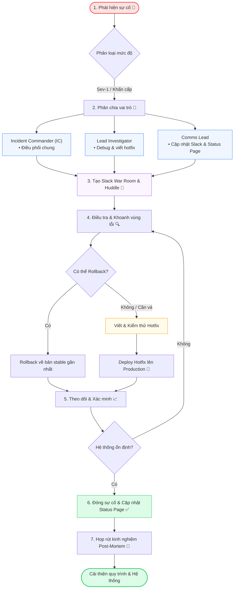

# Giao tiếp sự cố Production (Incident Response)

Khi xảy ra sự cố sập hệ thống (outage) hoặc phát sinh lỗi nghiêm trọng trên môi trường production, giao tiếp rõ ràng, bình tĩnh và có cấu trúc là vô cùng quan trọng. Cả team cần phối hợp ăn ý để phân loại lỗi (triage), cập nhật tiến độ cho các bên liên quan và triển khai bản sửa lỗi khẩn cấp (hotfix). Tài liệu này cung cấp các mẫu câu thực tế khi ứng phó sự cố.

---

## 1. Các Vai Trò Khi Xử Lý Sự Cố (War Room Roles)

Để phối hợp hiệu quả và giảm thiểu tối đa áp lực, team nên phân chia rõ ràng 3 vai trò sau:

1.  **Incident Commander (IC - Chỉ huy trưởng):** Điều phối chung toàn bộ quá trình xử lý sự cố, phân chia công việc cho các thành viên và đảm bảo team tập trung vào mục tiêu giải quyết lỗi.
2.  **Lead Investigator (Người điều tra chính):** Tập trung hoàn toàn vào việc debug, xem log hệ thống, tìm nguyên nhân và trực tiếp viết code/hotfix.
3.  **Communications Lead (Người phụ trách truyền thông):** Có nhiệm vụ cập nhật tình hình lên các channel Slack, báo cáo cho sếp/khách hàng, và quản lý trang status page để các lập trình viên không bị làm phiền.

---

## 2. Phát Cảnh Báo & Xác Định Sự Cố (Incident Alerting)

Thông báo lỗi ngay khi được xác nhận, chỉ ra dịch vụ nào bị hỏng và mức độ nghiêm trọng.

### 💡 10 Ví dụ thực tế:

1.  **"We have a live incident. The payment gateway is returning 502 Bad Gateway errors for all card transactions."** _(Chúng ta có sự cố live rồi. Cổng thanh toán đang trả về lỗi 502 Bad Gateway đối với tất cả các giao dịch bằng thẻ)._
2.  **"Alert: CPU usage on our primary database cluster has spiked to 100%, causing high latency across all APIs."** _(Cảnh báo: CPU trên cụm database chính đã vọt lên 100%, gây ra độ trễ cao trên toàn bộ các API)._
3.  **"I'm seeing a flood of error logs on Sentry related to the authentication service. It seems like users cannot log in."** _(Mình đang thấy một loạt log lỗi trên Sentry liên quan đến service xác thực. Có vẻ như người dùng không thể đăng nhập)._
4.  **"Alert: The frontend web client is currently returning a 404 page for all checkout requests."** _(Cảnh báo: Web client hiện đang trả về trang lỗi 404 đối với mọi yêu cầu thanh toán)._
5.  **"Critical: The mobile apps are failing to connect to the production backend API."** _(Khẩn cấp: Ứng dụng di động đang không thể kết nối tới API backend trên production)._
6.  **"We have confirmed a regression bug on the signup page. Users are unable to complete registration."** _(Chúng tôi đã xác nhận có lỗi regression (lỗi phát sinh sau khi deploy) ở trang đăng ký. Người dùng không thể hoàn thành việc đăng ký)._
7.  **"Warning: Third-party email API is experiencing major downtime. All verification emails are delayed."** _(Cảnh báo: API email của bên thứ ba đang bị sập diện rộng. Tất cả các email xác thực đều đang bị chậm)._
8.  **"Our server memory usage is climbing exponentially, indicating a severe leak in the latest release."** _(Dung lượng RAM server của chúng ta đang tăng theo cấp số nhân, cho thấy lỗi rò rỉ bộ nhớ nghiêm trọng ở bản release mới nhất)._
9.  **"Alert: The cron scheduler is triggering duplicate notification emails to users."** _(Cảnh báo: Bộ lập lịch cron đang kích hoạt gửi các email thông báo trùng lặp cho người dùng)._
10. **"Security warning: An unauthorized IP range is attempting a brute-force attack on the admin gateway."** _(Cảnh báo bảo mật: Một dải IP lạ đang cố tình thực hiện tấn công brute-force vào cổng admin)._

---

## 3. Phân Loại Lỗi & Phối Hợp Ứng Phó (Triage & Coordination)

Phân chia vai trò và tổ chức phòng xử lý sự cố (war room - thường là một cuộc gọi huddle hoặc channel chat khẩn cấp).

### 💡 10 Ví dụ thực tế:

1.  **"Let's set up a Slack war room in `#incident-payment-gateway` and jump on a huddle immediately."** _(Chúng ta hãy lập một phòng war room Slack trong channel `#incident-payment-gateway` và vào họp huddle ngay lập tức nhé)._
2.  **"I will lead the technical investigation. [Name], can you handle stakeholder communication and update the status page?"** _(Mình sẽ dẫn dắt phần điều tra kỹ thuật. [Tên] ơi, bạn xử lý phần giao tiếp với các bên liên quan và cập nhật trang status page của hệ thống nhé?)_
3.  **"Let's start by isolating the problem. Is this affecting both iOS and Android, or just Web clients?"** _(Hãy bắt đầu bằng việc khoanh vùng vấn đề. Lỗi này đang ảnh hưởng đến cả iOS và Android, hay chỉ mỗi bản Web thôi?)_
4.  **"Can we roll back to the last stable release (`v1.4.2`) while we investigate the root cause?"** _(Chúng ta có thể rollback về bản release ổn định gần nhất (`v1.4.2`) trong lúc điều tra nguyên nhân gốc rễ không?)_
5.  **"Huy, could you check the logs in Grafana? I'll review the recent database migration scripts."** _(Huy ơi, bạn check log trong Grafana giúp nhé? Mình sẽ review các script migration database gần đây)._
6.  **"Let's avoid deploying any non-essential code until we get this incident fully resolved."** _(Chúng ta hãy tạm dừng deploy các code không quan trọng cho tới khi sự cố này được xử lý hoàn toàn)._
7.  **"Who was the author of the latest auth PR? We need them in this huddle to explain the config changes."** _(Ai là người viết PR xác thực mới nhất vậy? Chúng ta cần họ vào huddle này để giải thích về các thay đổi cấu hình)._
8.  **"I will spin up a backup container to redirect traffic while we debug the main server."** _(Tôi sẽ dựng một container dự phòng để chuyển hướng traffic trong lúc chúng ta debug server chính)._
9.  **"Let's document the timeline of events in a shared document so we don't lose track."** _(Chúng ta hãy viết lại dòng thời gian sự kiện vào file tài liệu chung để không bị mất dấu vết)._
10. **"We need to contact AWS support immediately; it looks like a global outage on their S3 service."** _(Chúng ta cần liên hệ hỗ trợ AWS ngay lập tức; có vẻ đang có sự cố diện rộng trên dịch vụ S3 của họ)._

---

## 4. Cập Nhật Tình Hình Theo Thời Gian Thực (Incident Updates)

Các bên liên quan cần biết tiến độ thường xuyên. Kể cả khi chưa fix xong bug, hãy cập nhật là bạn đang xử lý đến bước nào.

### 💡 10 Ví dụ thực tế:

1.  **"Update: We have isolated the issue to a misconfigured environment variable in the payment service container."** _(Cập nhật: Chúng tôi đã khoanh vùng được lỗi là do cấu hình sai biến môi trường trong container của service payment)._
2.  **"We are currently running database diagnostics. The estimated time to identify the root cause is 15 minutes."** _(Chúng tôi hiện đang chạy chẩn đoán database. Thời gian dự kiến để xác định nguyên nhân gốc rễ là 15 phút)._
3.  **"No data loss has occurred. We are preparing a hotfix branch to address the validation issue."** _(Không có dữ liệu nào bị mất. Chúng tôi đang chuẩn bị một nhánh hotfix để xử lý lỗi validate này)._
4.  **"The rollback is complete, and traffic is returning to normal. We are keeping the war room active to monitor stability."** _(Việc rollback đã hoàn tất, traffic đang quay trở lại bình thường. Chúng tôi vẫn giữ phòng war room hoạt động để theo dõi sự ổn định)._
5.  **"Update: The server crash was triggered by a nested query loop. We are writing a fix to flatten it."** _(Cập nhật: Lỗi sập server xảy ra do một vòng lặp query lồng nhau. Chúng tôi đang viết bản sửa lỗi để tối ưu hóa nó)._
6.  **"We have successfully restored the cache layer, which brought CPU utilization down to 40%."** _(Chúng tôi đã khôi phục thành công lớp cache, giúp giảm tải CPU xuống còn 40%)._
7.  **"Next update will be in 20 minutes, or as soon as the hotfix build finishes in CI."** _(Bản cập nhật tiếp theo sẽ có sau 20 phút nữa, hoặc ngay khi bản build hotfix chạy xong trong CI)._
8.  **"Staging test was successful. We are now preparing to promote the fix to production."** _(Test trên staging đã thành công. Chúng tôi đang chuẩn bị đưa bản fix lên production)._
9.  **"The database lock has been manually cleared. Transactions are now processing slowly."** _(Lỗi khóa database đã được xử lý thủ công. Các giao dịch hiện tại đang được xử lý chậm)._
10. **"We have verified that the issue is local to the Hanoi cluster; other regions are functioning normally."** _(Chúng tôi đã xác minh lỗi này chỉ xảy ra cục bộ ở cụm máy chủ Hà Nội; các khu vực khác vẫn hoạt động bình thường)._

---

## 5. Triển Khai Hotfix & Xác Nhận Khắc Phục Thành Công

Khi deploy bản sửa lỗi khẩn cấp, hãy thông báo các bước và xác minh xem hệ thống đã thực sự chạy ổn định chưa.

### 💡 10 Ví dụ thực tế:

1.  **"The hotfix has been merged into `main` and is currently building in the pipeline."** _(Bản hotfix đã được merge vào nhánh `main` và đang được build trong pipeline)._
2.  **"Deploying the hotfix to production now. I will monitor the error rates on Sentry."** _(Đang deploy hotfix lên production. Mình sẽ theo dõi tỷ lệ lỗi (error rates) trên Sentry)._
3.  **"The fix is live. Can QA please run a sanity check on the staging and production environments?"** _(Bản fix đã chạy rồi. QA chạy thử một lượt kiểm tra nhanh (sanity check) trên môi trường staging và production giúp mình với?)_
4.  **"Error rates have dropped to zero, and CPU usage has normalized. The incident is now officially resolved."** _(Tỷ lệ lỗi đã giảm về 0 và CPU đã trở lại bình thường. Sự cố chính thức được giải quyết)._
5.  **"Deploying hotfix `v1.4.3-hotfix1` to production. It should take about 3 minutes to go live."** _(Đang deploy bản hotfix `v1.4.3-hotfix1` lên production. Sẽ mất khoảng 3 phút để hệ thống cập nhật)._
6.  **"We have successfully applied the schema migration. Read/write operations are fully restored."** _(Chúng tôi đã chạy thành công schema migration. Toàn bộ hoạt động đọc/ghi đã được khôi phục hoàn toàn)._
7.  **"The user interface is fully responsive again. I am checking the payment logs to confirm success."** _(Giao diện người dùng đã phản hồi mượt mà trở lại. Tôi đang kiểm tra log thanh toán để xác nhận kết quả)._
8.  **"Staging sanity check looks good. Promoting the patch to production cluster now."** _(Kiểm tra nhanh trên staging rất tốt. Tiến hành cập nhật bản vá lên cụm máy chủ production bây giờ)._
9.  **"Sentry shows no new errors in the last 10 minutes. The hotfix seems to have resolved the leak."** _(Sentry không ghi nhận thêm lỗi nào mới trong 10 phút qua. Bản hotfix có vẻ như đã xử lý triệt để lỗi rò rỉ)._
10. **"Incident is resolved. We are closing the war room channel and returning to normal operations."** _(Sự cố đã được giải quyết. Chúng tôi sẽ đóng channel war room và quay trở lại công việc bình thường)._

---

## 6. Rút Kinh Nghiệm Sau Sự Cố (Post-Incident Action Items)

Đảm bảo rút ra bài học kinh nghiệm từ sự cố để không lặp lại lỗi cũ.

### 💡 10 Ví dụ thực tế:

1.  **"We need to schedule a post-mortem meeting tomorrow morning to review why our health check failed to catch this."** _(Chúng ta cần lên lịch một cuộc họp mổ xẻ sự cố (post-mortem) vào sáng mai để xem tại sao hệ thống health check của chúng ta lại không bắt được lỗi này)._
2.  **"Action item: We must add automated integration tests for this payment gateway to prevent regression."** _(Action item: Chúng ta bắt buộc phải viết thêm các bài test tích hợp tự động cho cổng thanh toán này để tránh bị lỗi lại sau này)._
3.  **"We will update our monitoring dashboard to alert us immediately when API response latency exceeds 2 seconds."** _(Chúng tôi sẽ cập nhật dashboard giám sát để cảnh báo ngay lập tức khi độ trễ response API vượt quá 2 giây)._
4.  **"We should separate our history table to prevent primary database locks in the future."** _(Chúng ta nên tách bảng history ra để tránh lỗi khóa DB chính sau này)._
5.  **"Action item: Huy to write a post-mortem report and share it with the engineering director."** _(Action item: Huy viết báo cáo phân tích sự cố và chia sẻ cho giám đốc kỹ thuật)._
6.  **"We must implement a circuit breaker pattern on the third-party email service."** _(Chúng ta bắt buộc phải triển khai mô hình circuit breaker (ngắt mạch tự động) trên service email bên thứ ba)._
7.  **"We need to restrict write access to the production environment variables to prevent manual errors."** _(Chúng ta cần giới hạn quyền ghi đối với các biến môi trường production để ngăn các lỗi sửa thủ công bằng tay)._
8.  **"We will schedule a load testing session next week to find the next system bottleneck."** _(Chúng ta sẽ lên lịch một buổi test tải (load test) vào tuần tới để tìm các điểm nghẽn tiếp theo của hệ thống)._
9.  **"Action item: Update the onboarding docs to explain the database replication setup."** _(Action item: Cập nhật tài liệu onboarding để giải thích rõ cấu hình replica của database)._
10. **"We should set up a secondary CDN provider in case of future Cloudflare outages."** _(Chúng ta nên cài đặt thêm một nhà cung cấp CDN thứ hai để dự phòng trường hợp Cloudflare sập trong tương lai)._

---

## 7. Mẫu Thông Báo Sự Cố Chuẩn

### Mẫu Status Page (Dành cho Người dùng bên ngoài)

> **Investigating (Đang điều tra):** We are currently investigating an issue causing slow response times and error pages on our checkout page. Our engineering team is actively working on a fix.
> _(Chúng tôi đang tiến hành điều tra sự cố gây chậm thời gian phản hồi và xuất hiện trang lỗi trên trang checkout. Đội ngũ kỹ sư đang tích cực sửa lỗi)._
>
> **Identified (Đã xác định nguyên nhân):** We have identified a database locking issue as the root cause. We are preparing a database migration to resolve this.
> _(Chúng tôi đã xác định được nguyên nhân gốc rễ là do lỗi khóa database. Team đang chuẩn bị chạy migration để xử lý lỗi này)._
>
> **Monitoring (Đang theo dõi):** A fix has been deployed, and we are monitoring server performance to ensure stability.
> _(Bản sửa lỗi đã được deploy, chúng tôi đang theo dõi hiệu năng hệ thống để đảm bảo sự ổn định)._
>
> **Resolved (Đã khắc phục xong):** The checkout system is fully operational again. We apologize for any inconvenience caused.
> _(Hệ thống checkout đã hoạt động bình thường trở lại. Chúng tôi thành thật xin lỗi vì sự bất tiện này)._

---

## 8. Kịch Bản Chat Slack Xử Lý Sự Cố: `#incident-checkout-crash`

_Huy (Lead Dev), Lan (QA), và John (Comms Lead) cùng nhau xử lý một sự cố sập luồng thanh toán trên production._

- **10:15 AM - Huy:** `[Alert] checkout page is returning 500 Internal Server Error for Web users.` _(Lỗi: Trang thanh toán đang trả về lỗi 500 Internal Server Error đối với người dùng Web)._
- **10:16 AM - John:** `Got it. Setting this as Severity 1. I'll declare the incident and update the status page. Huy, are you the Lead Investigator?` _(Đã nhận thông tin. Đặt mức độ nghiêm trọng cấp 1. Tôi sẽ phát cảnh báo sự cố và cập nhật trang status page. Huy sẽ là người phụ trách điều tra đúng không?)._
- **10:17 AM - Huy:** `Yes, I am looking at Sentry now. Lan, can you verify if mobile app checkout is also affected?` _(Đúng vậy, tôi đang xem log trên Sentry. Lan check giúp xem luồng checkout trên app di động có bị ảnh hưởng không)._
- **10:19 AM - Lan:** `Testing iOS now... Yes, mobile is also returning 500 error during final step.` _(Đang test trên iOS... Có nhé, trên mobile cũng trả về lỗi 500 ở bước cuối cùng)._
- **10:20 AM - Huy:** `Found it. Sentry shows database connection pool timeout. We ran out of active connections because the new promotional widget query is too slow.` _(Tìm ra rồi. Sentry báo lỗi connection pool DB bị timeout. Chúng ta bị hết connection kết nối do câu query của widget khuyến mãi mới chạy quá chậm)._
- **10:22 AM - John:** `Understood. I will update stakeholders. What's the plan, Huy?` _(Đã hiểu. Tôi sẽ cập nhật cho các bên liên quan. Kế hoạch là gì vậy Huy?)._
- **10:23 AM - Huy:** `I will write a hotfix to disable the promo widget temporarily so users can check out. I am preparing the hotfix branch now.` _(Tôi sẽ viết hotfix để tạm thời tắt cái widget khuyến mại đi để user có thể check out bình thường. Đang chuẩn bị nhánh hotfix)._
- **10:28 AM - Huy:** `Hotfix build succeeded. Deploying to production now.` _(Build hotfix thành công. Tiến hành deploy lên production bây giờ)._
- **10:31 AM - Huy:** `Fix is live. Lan, please run a sanity check on staging and production.` _(Bản fix đã hoạt động rồi. Lan chạy sanity check trên staging và production giúp)._
- **10:33 AM - Lan:** `Staging checkout is successful. Production checkout works too! No errors in the console.` _(Luồng checkout staging chạy tốt. Trên production cũng ok luôn! Không thấy lỗi nào xuất hiện ở console)._
- **10:34 AM - Huy:** `Error rates dropped. CPU utilization is back to 15%. John, we are good to resolve the incident.` _(Tỷ lệ lỗi đã giảm hẳn. CPU quay về mức 15%. John ơi, chúng ta có thể đóng sự cố này)._
- **10:35 AM - John:** `Status page updated to Resolved. Let's schedule the post-mortem for tomorrow morning to optimize that widget query.` _(Đã cập nhật status page sang Resolved. Hãy lên lịch họp mổ xẻ sự cố vào sáng mai để tối ưu câu query widget đó nhé)._
