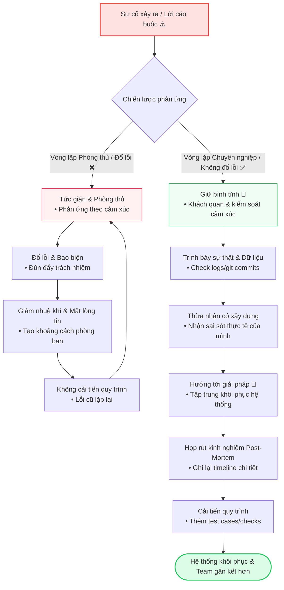

# Xử lý tình huống bị đổ lỗi (Blame Game)

Trong phát triển phần mềm, sai sót là điều khó tránh. Code bị lỗi, deployment thất bại, hoặc trễ deadline. Khi sự cố xảy ra, mọi người đôi khi có xu hướng tìm kiếm "tội đồ" (scapegoat) thay vì tìm giải pháp. Xử lý việc bị đổ lỗi và chỉ trích một cách chuyên nghiệp yêu cầu bạn phải giữ bình tĩnh, tập trung vào sự thật (facts), thừa nhận sai sót một cách xây dựng và hướng cuộc hội thoại quay lại việc tìm giải pháp khắc phục.

---

## 1. Giữ Bình Tĩnh & Hạ Nhiệt Cuộc Đối Thoại (De-escalating)

Khi đối mặt với những lời cáo buộc trực diện, hãy tránh phản ứng một cách phòng thủ (defensive) hoặc tức giận. Hãy giữ tông giọng khách quan và trung lập.

### 💡 10 Ví dụ thực tế:

1.  **"I understand that this outage is frustrating. Let’s focus on resolving the issue first, and then we can analyze how it happened."** _(Tôi hiểu rằng sự cố sập hệ thống này rất đáng bực mình. Chúng ta hãy tập trung xử lý lỗi trước, rồi sau đó mới phân tích xem nó xảy ra thế nào)._
2.  **"Let's take a step back and look at the sequence of events objectively."** _(Chúng ta hãy lùi lại một bước và nhìn nhận chuỗi sự kiện một cách khách quan)._
3.  **"I hear your concern, and I want to make sure we address the root cause rather than assigning blame."** _(Tôi hiểu lo ngại của bạn, và tôi muốn đảm bảo chúng ta giải quyết nguyên nhân gốc rễ thay vì đổ lỗi cho nhau)._
4.  **"I realize this bug delayed the launch. Let's redirect our energy toward deploying the fix first."** _(Tôi nhận thấy bug này đã trì hoãn buổi launch. Hãy dồn năng lượng của chúng ta vào việc deploy bản sửa lỗi trước đã)._
5.  **"Let's avoid pointing fingers and focus on restoring the checkout functionality."** _(Chúng ta hãy tránh đổ lỗi cho nhau và tập trung vào việc khôi phục chức năng checkout)._
6.  **"I understand the client is upset. Let's formulate a resolution plan before we trace back the error."** _(Tôi hiểu là khách hàng đang rất bực. Hãy đưa ra kế hoạch giải quyết trước khi chúng ta truy tìm nguồn gốc lỗi)._
7.  **"Let's keep the discussion professional and stick to the technical facts."** _(Hãy giữ cuộc thảo luận chuyên nghiệp và bám sát vào các sự thật kỹ thuật)._
8.  **"I appreciate that this is a critical issue. Let's work together to patch it first."** _(Tôi đánh giá cao mức độ quan trọng của vấn đề này. Hãy cùng nhau vá lỗi trước đã)._
9.  **"Arguments will not resolve the database lock. Let's look at the active queries together."** _(Cãi vã sẽ không giải quyết được vấn đề khóa database. Hãy cùng nhau kiểm tra các query đang chạy)._
10. **"Let's keep this conversation objective so we can quickly debug the container setup."** _(Hãy giữ cuộc hội thoại này thật khách quan để chúng ta có thể nhanh chóng debug cấu hình container)._

---

## 2. Phản Bác Các Cáo Buộc Vô Lý Bằng Sự Thật (Facts)

Nếu bạn hoặc team của bạn bị đổ lỗi cho một vấn đề không phải do lỗi của các bạn, hãy dùng log hệ thống, lịch sử commit git, hoặc lịch sử ticket Jira để trình bày sự thật.

### 💡 10 Ví dụ thực tế:

1.  **"Actually, the database migration script was run after receiving written approval from the product team. Here is the confirmation email."** _(Thực ra, script migration database đã được chạy sau khi nhận được sự phê duyệt bằng văn bản từ team product. Đây là email xác nhận)._
2.  **"The deployment failed because the API keys provided to us were invalid, as documented in the deployment logs here."** _(Việc deploy thất bại vì key API cung cấp cho chúng tôi không hợp lệ, như được ghi nhận lại trong log deploy ở đây)._
3.  **"Our team was not involved in the design of the database architecture. We implemented the schema exactly as specified in the architecture document."** _(Team chúng tôi không tham gia vào việc thiết kế kiến trúc database. Chúng tôi triển khai schema chính xác theo đặc tả trong tài liệu kiến trúc)._
4.  **"According to the Git history, the code change in question was committed three weeks ago by an external contractor."** _(Theo lịch sử Git, thay đổi code đang được nhắc tới đã được commit từ 3 tuần trước bởi một bên nhà thầu ngoài)._
5.  **"The delays were due to the third-party login service going down, which was outside our control."** _(Sự chậm trễ là do dịch vụ đăng nhập bên thứ ba bị sập, nằm ngoài tầm kiểm soát của chúng tôi)._
6.  **"We raised concerns about the scalability of this API structure in the design document dated May 5th."** _(Chúng tôi đã nêu ra những lo ngại về khả năng mở rộng của cấu trúc API này trong tài liệu thiết kế ngày 5 tháng 5)._
7.  **"The requirement to support IE11 was added mid-sprint, which naturally extended our development time."** _(Yêu cầu hỗ trợ IE11 được thêm vào giữa sprint, điều này hiển nhiên làm kéo dài thời gian code)._
8.  **"The staging server was updated manually by the QA team, not by our automated deployment scripts."** _(Server staging được cập nhật thủ công bởi team QA, không phải bằng các script deploy tự động của chúng tôi)._
9.  **"This endpoint behaves exactly as defined in the technical specification document."** _(Endpoint này hoạt động chính xác như những gì được định nghĩa trong tài liệu đặc tả kỹ thuật)._
10. **"The CPU spike occurred because of a sudden 10x traffic increase, not because of a bad code deploy."** _(CPU tăng vọt là do lượng truy cập đột ngột tăng gấp 10 lần, không phải do bản deploy code bị lỗi)._

---

## 3. Thừa Nhận Sai Lầm Một Cách Xây Dựng

Nếu bạn hoặc team của bạn thực sự phạm sai lầm, hãy thừa nhận nhanh chóng, chịu trách nhiệm và tập trung vào giải pháp. Đừng bao biện.

### 💡 10 Ví dụ thực tế:

1.  **"You are correct. We missed checking this edge case in our unit tests. I will update our test suite today to prevent this from happening again."** _(Bạn nói đúng. Chúng tôi đã bỏ sót việc check case đặc biệt này trong unit test. Tôi sẽ cập nhật bộ test suite hôm nay để tránh việc này lặp lại)._
2.  **"I apologize for the oversight. The regression was caused by a merge conflict that I resolved incorrectly. I am working on the fix now."** _(Tôi xin lỗi vì sơ suất này. Lỗi regression này xảy ra do một xung đột merge code mà tôi đã giải quyết sai. Tôi đang sửa lỗi ngay bây giờ)._
3.  **"We take full responsibility for the configuration error. Here is our plan to prevent similar issues in the future."** _(Chúng tôi hoàn toàn chịu trách nhiệm về lỗi cấu hình này. Đây là kế hoạch của chúng tôi để ngăn ngừa các sự cố tương tự sau này)._
4.  **"I miscalculated the complexity of this feature. I will work extra hours to ensure we don't miss the demo date."** _(Tôi đã tính toán sai độ phức tạp của tính năng này. Tôi sẽ làm thêm giờ để đảm bảo chúng ta không bị trễ ngày chạy demo)._
5.  **"That was indeed my mistake; I should have checked the environment flags before deploying."** _(Đó thực sự là lỗi của tôi; đáng lẽ tôi nên kiểm tra các flag môi trường trước khi deploy)._
6.  **"We overlooked the database constraints during the migration. We are fixing the rows manually now."** _(Chúng tôi đã bỏ qua các ràng buộc DB trong quá trình migration. Chúng tôi đang sửa lại dữ liệu thủ công ngay)._
7.  **"I apologize for not updating the API documentation earlier; I am doing it right now."** _(Tôi xin lỗi vì đã không cập nhật tài liệu API sớm hơn; tôi đang viết lại ngay bây giờ)._
8.  **"Our team missed the deadline because of a communication gap. We have adjusted our Slack notifications to avoid this."** _(Team chúng tôi bị trễ deadline vì thiếu thông tin. Chúng tôi đã cấu hình lại thông báo Slack để tránh việc này)._
9.  **"The timeout was due to an unoptimized query I wrote. I will optimize the joins immediately."** _(Lỗi timeout xảy ra do một câu query chưa được tối ưu mà tôi viết. Tôi sẽ tối ưu các lệnh join ngay lập tức)._
10. **"We made an error in the deployment configurations. We are initiating a rollback to fix it."** _(Chúng tôi đã gặp lỗi ở cấu hình deploy. Chúng tôi đang chạy rollback để xử lý lỗi)._

---

## 4. Kéo Cuộc Thảo Luận Quay Lại Giải Pháp

Khi đối phương cứ liên tục đay nghiến lỗi lầm, hãy khéo léo chuyển hướng cuộc trò chuyện sang kế hoạch khắc phục và các rào chắn phòng ngừa sau này.

### 💡 10 Ví dụ thực tế:

1.  **"The mistake has occurred, and we cannot change that. The most productive thing we can do now is focus on how to restore the service."** _(Sai lầm đã xảy ra và chúng ta không thể thay đổi nó. Việc hữu ích nhất cần làm bây giờ là tập trung khôi phục dịch vụ)._
2.  **"Instead of discussing whose fault this is, let's agree on the immediate actions needed to patch the security vulnerability."** _(Thay vì bàn luận xem đây là lỗi của ai, chúng ta hãy thống nhất các hành động cần thiết ngay lập tức để vá lỗ hổng bảo mật này)._
3.  **"Let’s schedule a blameless post-mortem tomorrow to document the timeline and put checks in place to prevent a recurrence."** _(Chúng ta hãy lên lịch một buổi họp mổ xẻ sự cố không đổ lỗi (blameless post-mortem) vào ngày mai để ghi lại timeline và đặt ra các bước kiểm tra ngăn ngừa tái diễn)._
4.  **"Let's move past the blame and talk about the hotfix deployment plan."** _(Hãy bỏ qua việc đổ lỗi và thảo luận về kế hoạch deploy bản hotfix)._
5.  **"To ensure this doesn't happen again, we should add automated lint checks to our pipeline."** _(Để đảm bảo việc này không lặp lại, chúng ta nên thêm các bước check lint tự động vào pipeline)._
6.  **"How can we help the QA team catch these visual bugs before production launches?"** _(Làm sao chúng ta có thể giúp team QA bắt được các lỗi hiển thị này trước khi chạy production?)._
7.  **"Let's focus on the recovery process; we can run a full root cause analysis once the system is stable."** _(Hãy tập trung vào quá trình khôi phục; chúng ta có thể phân tích nguyên nhân gốc rễ sau khi hệ thống ổn định)._
8.  **"What steps do we need to take to restore the deleted database tables?"** _(Chúng ta cần thực hiện các bước nào để khôi phục lại các bảng database đã bị xóa?)._
9.  **"Let's direct our focus to the upcoming hotfix release notes."** _(Hãy chuyển sự tập trung của chúng ta sang bản release note của hotfix sắp tới)._
10. **"Let's agree on a strategy to prevent duplicate transactions going forward."** _(Hãy thống nhất chiến lược ngăn chặn các giao dịch trùng lặp tiếp diễn)._

---

## 5. Kịch Bản Hội Thoại Minh Họa: "Tranh luận về việc trễ tiến độ release"

_Kịch bản dưới đây mô tả cuộc họp dự án nơi Product Manager (PM) đang có xu hướng đổ lỗi cho team dev vì trễ hạn release, và Tech Lead (TL) xử lý tình huống một cách chuyên nghiệp._

- **PM (John):** "The client dashboard launch is delayed by a week. This is a massive failure. Why did the engineering team fail to deliver this basic feature on time?" _(Buổi ra mắt client dashboard bị chậm một tuần. Đây là một thất bại lớn. Tại sao team kỹ sư không bàn giao được tính năng cơ bản này đúng hạn?)._
- **TL (Huy):** "I understand your frustration, John. The delay is disappointing. Let's look at the timeline objectively so we can deliver the remaining features successfully." _(Tôi hiểu sự ức chế của anh, John. Việc chậm trễ rất đáng tiếc. Hãy cùng nhìn nhận lại dòng thời gian một cách khách quan để chúng ta có thể bàn giao các tính năng còn lại một cách thành công)._
- **PM (John):** "But Huy, your developers promised it would be ready by Friday. Clearly, someone didn't work hard enough." _(Nhưng Huy này, các dev của anh đã hứa nó sẽ xong vào thứ Sáu. Rõ ràng là có ai đó đã không làm việc hết sức mình)._
- **TL (Huy):** _(Đưa sự thật ra phản bác)_ "Actually, the initial estimate was based on the original requirements. During the sprint, the requirements for the checkout logic were updated three times, which added considerable complexity. Our team spent 20 additional hours refactoring the code to match these changes." _(Thực ra, ước tính ban đầu dựa trên yêu cầu gốc. Trong suốt sprint, các yêu cầu cho logic checkout đã bị sửa đổi 3 lần, làm tăng độ phức tạp đáng kể. Team đã phải dành thêm 20 giờ để refactor code nhằm khớp với các thay đổi này)._
- **PM (John):** "Well, you should have warned us about the delays earlier!" _(Thế thì đáng lẽ anh phải cảnh báo cho chúng tôi biết về sự trễ hạn này sớm hơn chứ!)._
- **TL (Huy):** _(Thừa nhận một cách xây dựng)_ "You are correct; we should have communicated the impact of these changes sooner. I take responsibility for the communication gap, and we will update our sprint alerts going forward." _(Anh nói đúng; chúng tôi đáng lẽ nên thông báo về tác động của các thay đổi này sớm hơn. Tôi xin nhận trách nhiệm về thiếu sót giao tiếp này, và chúng tôi sẽ cập nhật các cảnh báo tiến độ sprint sau này)._
- **PM (John):** "So how do we fix this now? The client is waiting." _(Thế giờ sửa thế nào đây? Khách hàng đang đợi)._
- **TL (Huy):** _(Hướng tới giải pháp)_ "The most productive step now is to release the dashboard in phases. We can deploy the core metrics today, followed by the secondary charts on Friday. This allows the client to start using the system immediately." _(Hành động hữu ích nhất bây giờ là release dashboard theo từng giai đoạn. Chúng ta có thể deploy các số liệu cốt lõi hôm nay, tiếp theo là các biểu đồ phụ vào thứ Sáu. Việc này cho phép khách hàng bắt đầu sử dụng hệ thống ngay lập tức)._
