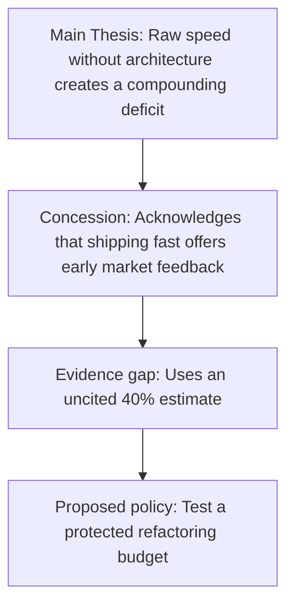

---
{
  'id': 'b2-13-editorial-reading',
  'slug': 'b2-13-editorial-reading',
  'titleEn': 'Editorial and Critical Reading',
  'titleVi': 'Đọc xã luận và phân tích phản biện',
  'subtitleEn': 'Analyze engineering leadership op-eds, detect rhetorical strategies, and evaluate technical arguments',
  'subtitleVi': 'Đọc hiểu và phân tích phản biện các bài xã luận công nghệ, nhận diện luận điểm và cấu trúc lập luận',
  'level': 'B2',
  'unit': 3,
  'skill': 'reading',
  'order': 13,
  'cefr': 'B2',
  'minutes': 16,
  'tags': ['reading', 'editorial', 'critical-thinking', 'analysis', 'B2'],
  'audioScript': "The fictional author contends that pursuing short-term feature velocity at the expense of architecture creates a compounding deficit.\nThe passage uses an uncited forty-percent estimate, so a critical reader should ask for the underlying study and method.\nThe author presents a protected refactoring budget as one policy to test rather than a universal rule.\n",
  'listeningEnabled': true,
  'flashcardCount': 6,
  'quiz':
    [
      {
        'type': 'choice',
        'prompt': 'What is the primary rhetorical function of the phrase "While proponents argue that..." in an editorial?',
        'options':
          [
            'It introduces a concession or counter-argument before refuting it with stronger evidence.',
            'It attributes a competing view, but the phrase alone does not show whether the author will accept or challenge it.',
            'It signals that the next sentence will provide neutral background rather than evaluate the competing view.',
          ],
        'answer': 'It introduces a concession or counter-argument before refuting it with stronger evidence.',
        'explanation': 'In this passage, the author acknowledges the proponents’ position and then pivots to a rebuttal. The surrounding sentences—not the marker alone—establish that function.',
        'distractorFeedback':
          {
            'It attributes a competing view, but the phrase alone does not show whether the author will accept or challenge it.': 'This is true of the marker in isolation, but the question asks about its function in the full passage, where a rebuttal follows.',
            'It signals that the next sentence will provide neutral background rather than evaluate the competing view.': 'The following sentence evaluates and challenges the competing view rather than remaining neutral.',
          },
      },
      {
        'type': 'fill',
        'prompt': 'Critics ___ that cutting corners on test automation creates an illusion of speed.',
        'answer': 'contend',
        'acceptedAnswers': ['contend', 'argue'],
        'explanation': 'Both "contend" and "argue" can report a disputed claim. The canonical answer highlights the lesson’s target verb.',
      },
      {
        'type': 'choice',
        'prompt': 'Which evidence problem should a critical reader flag in the fictional editorial?',
        'options':
          [
            'The 40% figure is not connected to a named study, dataset, or method.',
            'The author uses a metaphor to compare technical debt with financial interest.',
            'The author recommends reserving capacity for refactoring instead of waiting for a crisis.',
          ],
        'answer': 'The 40% figure is not connected to a named study, dataset, or method.',
        'explanation': 'A precise percentage can sound authoritative, but readers cannot evaluate it without a traceable source and method. The other options describe rhetorical or policy choices, not missing evidence.',
        'distractorFeedback':
          {
            'The author uses a metaphor to compare technical debt with financial interest.': 'A metaphor can be evaluated for framing, but its presence is not the missing empirical support attached to the percentage.',
            'The author recommends reserving capacity for refactoring instead of waiting for a crisis.': 'This is a policy recommendation to assess, not the specific sourcing problem in the supporting evidence.',
          },
      },
    ],
  'categoryEn': 'Technical Leadership Communication',
  'categoryVi': 'Giao tiếp Dẫn dắt Kỹ thuật',
  'prerequisites': ['b2-12-complex-sentence-structures'],
  'editorialStatus': 'pilot-reviewed',
  'sourceType': 'fictional',
  'practiceContract': { 'mode': 'writing', 'minWords': 45, 'maxWords': 90 },
}
---

# Editorial and Critical Reading

## The Analytical Reading Challenge

At the B2 level, reading technical literature means moving beyond simple comprehension. Senior engineers must evaluate **engineering editorials**, **analyst op-eds**, and **whitepaper arguments** to discern between evidence-backed strategies and marketing hype.

Critical reading requires you to identify the **core thesis**, spot **counterarguments**, and evaluate whether the author's conclusions logically follow from their premises.

> **Pattern**: `While proponents contend that [claim A], closer inspection reveals that [rebuttal B with evidence].`

---

## Fictional Editorial Passage: The Velocity Illusion

**Training note:** _Modern Engineering Perspectives_ is a fictional publication created for this lesson. The percentages and operational claims below are illustrative, not research findings.

**Fictional publication:** _Modern Engineering Perspectives_

**Title:** _The Velocity Illusion: Why Fast Shipping Without Architecture Kills Scale_

The software industry is obsessed with shipping speed. In recent years, startup doctrine has mandated that teams must "move fast and break things" to capture market share. However, this philosophy harbors a dangerous fallacy: confusing raw deployment frequency with sustainable engineering velocity.

**While proponents argue that** immediate feature delivery maximizes market feedback, the author claims that internal post-mortems show unmanaged technical debt acting as a compounding financial drag. When teams bypass modular design and automated regression suites, codebases can degrade into brittle systems. **In light of the fictional outages described here**, the author estimates that quick-fix implementations consume over 40% of engineering bandwidth on triage and firefighting—but provides no study or method for that figure.

Critics of continuous refactoring often emphasize its opportunity cost. The author counters that neglecting architecture defers costs at a high interest rate. **In response to** demands for unchecked feature expansion, the article recommends that engineering leaders protect time for architectural remediation. It presents a 20% capacity budget as one possible policy, not a universal benchmark.

---

## Rhetorical Markers & Critical Vocabulary

| Academic/Opinion Term          | Rhetorical Function                                           | Context in Argumentation                                                  |
| :----------------------------- | :------------------------------------------------------------ | :------------------------------------------------------------------------ |
| **Contend / Argue that**       | Report an assertion without presenting it as universal truth. | "Critics contend that the deadline is unrealistic."                       |
| **In light of [evidence]**     | Ground an assertion in recent events, data, or findings.      | "In light of recent benchmark metrics, we must upgrade the cache."        |
| **Compounding drag / deficit** | Metaphorical language describing growing negative impacts.    | "Technical debt creates a compounding drag on developer velocity."        |
| **Overlook [factor]**          | Highlight a blind spot or weakness in the opposing argument.  | "The proposal overlooks the ongoing infrastructure maintenance cost."     |
| **In response to [challenge]** | Pivot smoothly to present a proactive alternative.            | "In response to customer latency reports, we initiated a database audit." |

---

## Identifying Argument Structure

---

## Quick quiz

Test your critical reading and rhetorical analysis in the quiz above.

---

## What to learn next

In the next lesson **B2-14-formal-correspondence**, you will apply clear, structured writing techniques to professional client emails and formal memoranda.

<!-- learning-loop:start -->

## Learning outcome

By the end of this lesson, you can analyze an opinion-driven technical editorial, identify the author's primary thesis and supporting concessions, and articulate a reasoned critical response in 3–4 sentences.

## Practice lab

### Notice the rhetorical moves

Read the passage once for the overarching message, and a second time to locate the author's pivot words (`However`, `While proponents argue`, `In light of`, `Rather than`).

### Controlled comprehension check

1. **What is the author's main counter-argument to "moving fast"?**
   _Answer:_ The author argues that short-term speed can create compounding technical debt and later consume substantial engineering time.
2. **What concrete mechanism does the author propose instead of crisis cleanup?**
   _Answer:_ Testing a protected sprint-capacity budget for continuous architectural remediation.

### Guided analytical task

**Scenario:** A tech blog argues that "Microservices are always superior to monoliths for all engineering teams."

**Your task:** Write a 45–90-word, 3-sentence critical evaluation using the opinion markers from this lesson (`While proponents contend...`, `In light of...`, `It is essential to recognize...`).

### Model response

> "While proponents contend that microservices inherently offer superior scalability, this perspective overlooks the operational overhead of distributed tracing and cross-network latency. In light of real-world team constraints, microservices often introduce unnecessary complexity for small engineering squads. Therefore, it is essential to evaluate architectural fit based on domain boundaries rather than adopting industry trends blindly."

### Self-check rubric

- [ ] I identified both the opposing claim and the counter-evidence.
- [ ] I used formal analytical reporting verbs (`contend`, `overlook`, `in light of`).
- [ ] My analysis focused on objective engineering trade-offs rather than emotional reaction.

<!-- learning-loop:end -->
