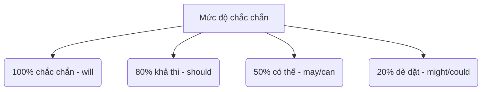

# TÀI LIỆU NGỮ PHÁP SPEAKING THỰC DỤNG

## Ngữ pháp, công thức và từ vựng thực tế dùng cho họp hành và giao tiếp trong công việc

> **Mục đích của tài liệu này**
>
> - Tài liệu tham khảo tập trung vào ngữ pháp và từ vựng thực tế dùng trong giao tiếp nói (Speaking).
> - Phục vụ các cuộc họp hàng tuần (weekly meetings), cập nhật hàng ngày (daily standups), hỏi đáp với khách hàng (Q&A), theo dõi tiến độ (follow-ups) và giải thích logic hệ thống.
> - Ưu tiên các mẫu câu ngắn gọn, rõ ràng, tự nhiên, dễ nhớ và có thể áp dụng được ngay.
> - Bao gồm các ví dụ thực tế — chỉ cần thay thế từ khóa và sử dụng ngay lập tức.

> **Cách sử dụng tài liệu này**
>
> - Không học ngữ pháp theo kiểu lý thuyết hàn lâm.
> - Học theo nhóm: công thức nói, thì động từ, từ nối, giới từ, cấu trúc câu thông dụng.
> - Tra cứu trực tiếp phần ngữ pháp phù hợp với tình huống giao tiếp của bạn.
> - Ghi nhớ các câu ví dụ trước, sau đó mới liên hệ đến tên cấu trúc ngữ pháp để hiểu bản chất.

---

# 1. TƯ DUY NGỮ PHÁP KHI NÓI (SPEAKING MINDSET)

## 1.1. Mục tiêu thực tế

Khi nói trong các buổi họp, bạn không cần dùng cấu trúc ngữ pháp quá phức tạp hay hoa mỹ. Bạn chỉ cần:

- **Đúng ý chính (Correct main idea)**: Tập trung truyền tải rõ ràng thông tin cần thiết.
- **Đúng thì cơ bản (Correct basic tense)**: Chọn đúng thì để khách hàng biết việc đó đã làm, đang làm hay sắp làm.
- **Câu ngắn gọn, dễ hiểu (Short, clear sentences)**: Tránh viết/nói câu ghép quá dài. Hãy ngắt câu bằng dấu chấm.
- **Lặp lại các công thức quen thuộc (Repeat familiar formulas)**: Sử dụng các mẫu câu có sẵn để giảm thời gian suy nghĩ.

## 1.2. Các công thức an toàn nhất

Nếu bạn bị bí từ hoặc không biết diễn đạt thế nào, hãy dùng ngay các cấu trúc cơ bản sau:

- **We completed [task].** (Chúng tôi đã hoàn thành [nhiệm vụ].)
- **We're working on [task].** (Chúng tôi đang làm [nhiệm vụ].)
- **We'll focus on [task].** (Chúng tôi sẽ tập trung vào [nhiệm vụ].)
- **We found an issue with [topic].** (Chúng tôi phát hiện ra một lỗi liên quan đến [chủ đề].)
- **Could you clarify [point]?** (Bạn có thể làm rõ [điểm này] giúp tôi không?)
- **Let me double-check and get back to you.** (Để tôi kiểm tra lại kỹ và phản hồi bạn sau.)

---

# 2. CẤU TRÚC CÂU CƠ BẢN (BASIC SENTENCE STRUCTURES)

## 2.1. Cấu trúc 1: Chủ ngữ + Động từ (S-V)

Loại câu đơn giản nhất. Rất tốt khi muốn cập nhật trạng thái nhanh hoặc xác nhận thông tin lập tức.

### 💡 Ví dụ

- **The system works correctly.** (Hệ thống hoạt động đúng rồi.)
- **We agree with this approach.** (Chúng tôi đồng ý với cách tiếp cận này.)
- **The API failed.** (API đã bị lỗi.)

## 2.2. Cấu trúc 2: Chủ ngữ + Be + Tính từ (S-Be-Adj)

Dùng để mô tả trạng thái, tình trạng hiện tại của công việc.

### 💡 Ví dụ

- **The feature is ready.** (Tính năng đã sẵn sàng.)
- **The issue is minor.** (Lỗi này nhỏ thôi.)
- **The server is down.** (Máy chủ đang bị sập.)

## 2.3. Cấu trúc 3: Chủ ngữ + Động từ + Tân ngữ (S-V-O)

Cấu trúc câu phổ biến nhất để nói rõ ai làm hành động gì.

### 💡 Ví dụ

- **We finished the API integration.** (Chúng tôi đã tích hợp xong API.)
- **The team reviewed the feedback.** (Team đã xem lại phản hồi rồi.)
- **The client confirmed the requirement.** (Khách hàng đã xác nhận yêu cầu.)

## 2.4. Cấu trúc 4: Chủ ngữ + Động từ + Mệnh đề "That" (S-V-That)

Dùng khi đưa ra ý kiến, lời khẳng định, báo cáo hoặc giải thích.

### 💡 Ví dụ

- **We think that this flow is correct.** (Chúng tôi nghĩ là luồng này đúng rồi.)
- **I believe that this approach is safer.** (Tôi tin rằng cách tiếp cận này an toàn hơn.)
- **We confirmed that the issue came from the API.** (Chúng tôi xác nhận lỗi bắt nguồn từ phía API.)

## 2.5. Cấu trúc 5: If + điều kiện, kết quả (If-clause)

Dùng để giải thích logic nghiệp vụ, quy tắc hệ thống hoặc hệ quả.

### 💡 Ví dụ

- **If the user clicks this button, the modal opens.** (Nếu người dùng click nút này, modal sẽ mở ra.)
- **If we get confirmation today, we'll start tomorrow.** (Nếu chúng tôi nhận được xác nhận hôm nay, ngày mai chúng tôi sẽ bắt đầu.)

---

# 3. CÁC THÌ ĐỘNG TỪ CHỦ CHỐT VÀ SỰ KHÁC BIỆT CHI TIẾT

Sử dụng sai thì động từ có thể gây hiểu lầm lớn về mặt tiến độ. Dưới đây là cách ánh xạ các thì trực tiếp vào báo cáo công việc của bạn.

## 3.1. Thì hiện tại đơn (Present Simple - Dùng cho Logic & Sự thật)

Dùng để mô tả các trạng thái lâu dài, quy luật chung, logic nghiệp vụ của hệ thống hoặc cách một tính năng hoạt động.

### 🔣 Công thức

- **S + V(s/es)**

### 💡 Ví dụ

- **The system sends an email after approval.** (Hệ thống sẽ gửi email sau khi được duyệt.)
- **The user selects a payment method.** (Người dùng chọn phương thức thanh toán.)
- **This database stores transaction logs.** (Database này lưu trữ log giao dịch.)

## 3.2. Thì hiện tại tiếp diễn (Present Continuous - Việc đang làm)

Dùng để cập nhật trực tiếp những công việc bạn hoặc team đang tiến hành tại chính thời điểm họp.

### 🔣 Công thức

- **S + am/is/are + V-ing**

### 💡 Ví dụ

- **We're working on the admin dashboard.** (Chúng tôi đang làm màn hình admin.)
- **The team is fixing the remaining bugs.** (Cả team đang sửa nốt các bug còn lại.)
- **I am checking the API response logs.** (Tôi đang kiểm tra log phản hồi của API.)

## 3.3. Thì hiện tại hoàn thành vs. Quá khứ đơn (Phân biệt khi báo cáo tiến độ)

Đây là điểm dễ gây nhầm lẫn nhất khi trao đổi với khách hàng.

### Thì hiện tại hoàn thành: Báo cáo trạng thái hoàn thành (Không nêu thời gian cụ thể)

Dùng thì hiện tại hoàn thành khi muốn thông báo một task **đã làm xong và hiện tại đã sẵn sàng**. Trọng tâm là **kết quả hiện tại**, không phải thời điểm làm.

- **Công thức**: `S + have/has + V3/ed`
- **Ví dụ**: **"We have deployed the changes."** (Chúng tôi đã deploy xong các thay đổi rồi - Kết quả: Hiện tại server đã có code mới, khách có thể vào test).

### Thì quá khứ đơn: Báo cáo sự kiện đã xảy ra (Có thời gian cụ thể trong quá khứ)

Dùng thì quá khứ đơn nếu bạn muốn nhấn mạnh vào **thời điểm cụ thể** trong quá khứ khi hành động xảy ra (ví dụ: yesterday, last night, 2 hours ago).

- **Công thức**: `S + V2/ed`
- **Ví dụ**: **"We deployed the changes yesterday."** (Trọng tâm: Việc deploy đã diễn ra vào ngày hôm qua).

| Tình huống   | Hiện tại hoàn thành (Không thời gian cụ thể)             | Quá khứ đơn (Có thời gian cụ thể)                                     |
| :----------- | :------------------------------------------------------- | :-------------------------------------------------------------------- |
| **Sửa Bug**  | We've fixed the login bug. (Đã sửa xong, test được luôn) | We fixed the bug 2 hours ago. (Vừa sửa xong cách đây 2 tiếng)         |
| **Cập nhật** | The client has updated the ticket. (Vé đã được cập nhật) | The client updated the ticket on Monday. (Khách cập nhật hôm thứ Hai) |
| **Release**  | We have released version 1.2. (Bản 1.2 đã lên)           | We released version 1.2 last week. (Đã release từ tuần trước)         |

## 3.4. Thì tương lai: will vs. going to / plan to

- **will**: Dùng cho lời hứa tức thời, quyết định đưa ra ngay tại cuộc họp.
  - _Ví dụ_: **"I will email you the link after we finish."** (Tôi sẽ gửi mail link ngay sau khi họp xong.)
- **going to / plan to**: Dùng cho kế hoạch đã được sắp xếp trước, lộ trình dự kiến.
  - _Ví dụ_: **"We are going to start testing tomorrow."** (Chúng tôi đã lên lịch chạy test vào ngày mai.)

---

# 4. ĐỘNG TỪ KHUYẾT THIẾU & MỨC ĐỘ CHẮC CHẮN (CERTAINTY)

Trong giao tiếp với khách hàng, hãy tránh việc hứa chắc chắn 100% đối với những việc bạn chưa hoàn toàn kiểm chứng. Hãy dùng động từ khuyết thiếu để quản lý kỳ vọng (expectation management).

- **will** (100%): Cam kết chắc chắn xảy ra.
  - **"We will fix this by tomorrow."** (Chúng tôi chắc chắn sẽ sửa xong trước ngày mai).
- **should** (80%): Kết quả dự kiến sẽ xảy ra nếu theo đúng logic bình thường.
  - **"The server should restart automatically."** (Theo cấu hình thì server sẽ tự động restart).
- **may / can** (50%): Khả năng có thể xảy ra nhưng chưa chắc chắn.
  - **"This issue may delay the release."** (Vấn đề này có thể sẽ làm chậm tiến độ release).
- **might / could** (20%): Khả năng rất thấp, mang tính dè dặt hoặc cảnh báo rủi ro.
  - **"We could run into database issues if we change this configuration."** (Chúng ta có thể gặp lỗi DB nếu đổi config này - cảnh báo rủi ro).

---

# 5. THỂ BỊ ĐỘNG DÙNG TRONG GIAO TIẾP NGOẠI GIAO (DIPLOMATIC PASSIVE VOICE)

Hãy dùng thể bị động khi muốn trao đổi một cách khách quan, chuyên nghiệp hoặc để **giảm bớt sự đổ lỗi** khi giải thích về sai sót hoặc sự cố.

- **Chủ động (Trực diện / Đổ lỗi)**: "Our developer deleted the database table." (Lập trình viên của tôi đã xóa bảng dữ liệu.)
- **Bị động (Khách quan / Ngoại giao)**: "The database table was accidentally deleted." (Bảng dữ liệu đã vô tình bị xóa.)

### Các mẫu bị động thông dụng:

- **The issue has been resolved.** (Vấn đề đã được giải quyết - Tập trung vào kết quả, không cần khoe ai làm.)
- **The feature was deployed yesterday.** (Tính năng đã được deploy hôm qua.)
- **The database credentials were changed.** (Thông tin kết nối cơ sở dữ liệu đã thay đổi.)
- **You will be notified once the build completes.** (Bạn sẽ được thông báo sau khi build xong.)

---

# 6. MỆNH ĐỀ QUAN HỆ ĐỂ RÚT GỌN CÂU (RELATIVE CLAUSES)

Mệnh đề quan hệ giúp bạn nối 2 ý ngắn thành 1 câu ghép mượt mà, chuyên nghiệp và tiết kiệm thời gian nói.

- **Thay vì nói**: "We found a bug. It blocks users from registering."
- **Nên nói**: **"We found a bug that blocks users from registering."** (Chúng tôi tìm thấy một bug mà nó chặn người dùng đăng ký.)

### Các đại từ quan hệ cốt lõi trong IT:

- **that / which** (dùng cho vật/tính năng):
  - **"We updated the API endpoint that was causing the slow load time."** (Đã update API endpoint cái mà gây ra việc load chậm.)
- **who** (dùng cho người):
  - **"The developer who is handling the payment flow is out today."** (Dev người mà làm cổng thanh toán hôm nay nghỉ phép.)
- **where** (dùng cho trang, các bước hoặc vị trí):
  - **"This is the screen where the validation error occurs."** (Đây là màn hình nơi mà xảy ra lỗi validate.)
- **when** (dùng cho thời gian/sự kiện):
  - **"That was the moment when the server went down."** (Đó là thời điểm lúc mà server bị sập.)

---

# 7. GIỚI TỪ DÙNG TRONG NGÀNH CÔNG NGHỆ THÔNG TIN (IT PREPOSITIONS)

Sử dụng giới từ đúng trong IT rất quan trọng để tránh gây hiểu lầm. Hãy học thuộc lòng các cụm sau:

### 📱 Dùng "On" (Giao diện, Màn hình, Nền tảng)

- **on** the screen / page / dashboard (trên màn hình / trang / trang quản trị)
- **on** mobile / desktop (trên di động / máy tính)
- **on** AWS / the cloud (trên AWS / đám mây)
- **on** the homepage (trên trang chủ)

### 💾 Dùng "In" (Trong Code, Database, Trạng thái)

- **in** the code / script (trong code / mã script)
- **in** the database / table (trong database / bảng dữ liệu)
- **in** the database config (trong file cấu hình DB)
- **in** progress / in review (đang tiến hành / đang được review)

### 🌐 Dùng "At" (URL Endpoints, Địa điểm chính xác)

- **at** the endpoint URL (tại URL endpoint)
- **at** the bottom of the page (ở phía cuối trang)
- **at** the moment (vào lúc này)

### ⏳ Dùng "By" (Mốc hạn chót - Deadlines)

- **by** Friday / tomorrow / 5 PM (trước thứ Sáu / trước ngày mai / trước 5h chiều)

---

# 8. TỪ NỐI ĐỂ LIÊN KẾT Ý MẠCH LẠC (CONNECTORS)

Hãy dùng các từ nối sau để bài phát biểu cập nhật tiến độ của bạn có cấu trúc rõ ràng, chuyên nghiệp.

### 8.1. Thứ tự trước sau (Sequencing)

- **"First, we finished the UI. Next, we will connect the API. Finally, we will run the tests."** (Đầu tiên chúng tôi làm xong UI. Tiếp theo sẽ kết nối API. Cuối cùng sẽ chạy test.)

### 8.2. Thêm thông tin (Adding Information)

- **"We updated the profile page. Also, we added validation to the email field."** (Chúng tôi đã update trang cá nhân. Ngoài ra cũng thêm validate vào trường email.)

### 8.3. Đối lập, tương phản (Handling issues/contrast)

- **"The database queries are optimized. However, the external API is still slow."** (Các câu query DB đã được tối ưu. Tuy nhiên, API bên thứ ba vẫn chậm.)

### 8.4. Nguyên nhân và Kết quả (Cause and Effect)

- **"The payment provider changed their API, so we have to update our code."** (Nhà cung cấp thanh toán đã đổi API, nên chúng tôi phải cập nhật lại code.)
- **"We missed the response from the server. As a result, the user sees a timeout error."** (Chúng ta bị lỡ phản hồi từ server. Kết quả là người dùng thấy lỗi timeout.)

---

# 9. CÁC CÂU NÓI GIẢM NÓI TRÁNH (SOFTENING & DIPLOMACY)

Làm thế nào để nói giảm nói tránh lịch sự khi phải từ chối hoặc đưa tin xấu cho khách hàng.

### 9.1. Từ chối/bất đồng ý kiến lịch sự

- **"I see your point, but..."** (Tôi hiểu ý của bạn, nhưng...)
- **"That is a good option, however, it might take longer to build."** (Đó là phương án tốt, tuy nhiên, nó có thể mất nhiều thời gian phát triển hơn.)

### 9.2. Giảm nhẹ yêu cầu (Nhờ vả lịch sự)

- **"Could you please confirm the priority?"** (Bạn có thể vui lòng xác nhận độ ưu tiên giúp chúng tôi không?)
- **"It would be helpful if you could share the design specs."** (Sẽ rất hữu ích nếu bạn có thể chia sẻ tài liệu thiết kế.)
- **"Would you mind double-checking this logic?"** (Bạn có phiền kiểm tra lại logic này giúp không?)

### 9.3. Trả lời khi chưa có thông tin chính xác (Tránh nói "I don't know" trực diện)

- **"I don't have the exact answer right now. Let me check and get back to you."** (Tôi chưa có câu trả lời chính xác ngay lúc này. Để tôi kiểm tra và phản hồi lại bạn.)
- **"I want to verify this with the team first to give you the most accurate response."** (Tôi muốn xác nhận lại với team trước để đưa ra câu trả lời chính xác nhất cho bạn.)

---

# 10. CÁC LỖI THƯỜNG GẶP CẦN TRÁNH (COMMON MISTAKES)

### ❌ Lỗi 1: Dùng "Discuss about"

- _Sai_: "We need to discuss about the database design."
- _Đúng_: **"We need to discuss the database design."** (Sau "discuss" là tân ngữ luôn, không có "about").

### ❌ Lỗi 2: Dùng "Explain me"

- _Sai_: "Can you explain me this feature?"
- _Đúng_: **"Can you explain this feature to me?"** hoặc **"Can you explain this feature?"**

### ❌ Lỗi 3: Quên chia thì quá khứ đối với task đã làm xong

- _Sai_: "Yesterday we deploy the website."
- _Đúng_: **"Yesterday we deployed the website."** (Có "yesterday" thì động từ bắt buộc phải ở quá khứ).

### ❌ Lỗi 4: Dùng "I'm agree"

- _Sai_: "I'm agree with you."
- _Đúng_: **"I agree with you."** (Agree là động từ thường, không dùng với "am").

---

# 11. BẢNG TRA CỨU NHANH (QUICK REFERENCE CHEAT SHEET)

## 11.1. Báo cáo tiến độ nhanh (Status Reporting)

- **Task đã xong**: **"We have completed [task]."** / **"We completed [task] yesterday."**
- **Task đang làm**: **"We are currently working on [task]."** / **"We're working on [task]."**
- **Task sắp tới**: **"Next, we will focus on [task]."** / **"We plan to start [task] tomorrow."**
- **Blockers / Lỗi**: **"We ran into a blocker with [topic]."** / **"We have an issue with [topic]."**

## 11.2. Bảng quy chuẩn giới từ thông dụng

| Cụm từ    | Giới từ đúng                       | Ví dụ thực tế                                 |
| :-------- | :--------------------------------- | :-------------------------------------------- |
| Work      | **on** a task                      | "We are working **on** the payment gateway."  |
| Focus     | **on** an issue                    | "Let's focus **on** the performance bug."     |
| Look      | **into** a bug                     | "We will look **into** the connection error." |
| Follow up | **on** a thread                    | "I'll follow up **on** that email today."     |
| Agree     | **with** a person / **on** a topic | "We agree **on** the proposed timeline."      |
| Issue     | **with** a feature                 | "There is an issue **with** the login form."  |

---
