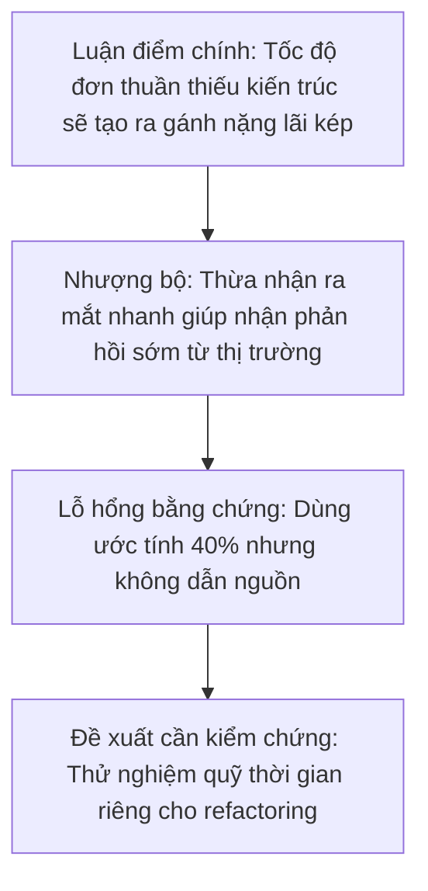

---
{
  'id': 'b2-13-editorial-reading',
  'slug': 'b2-13-editorial-reading',
  'titleEn': 'Editorial and Critical Reading',
  'titleVi': 'Đọc xã luận và phân tích phản biện',
  'subtitleEn': 'Analyze engineering leadership op-eds, detect rhetorical strategies, and evaluate technical arguments',
  'subtitleVi': 'Đọc hiểu và phân tích phản biện các bài xã luận công nghệ, nhận diện luận điểm và cấu trúc lập luận',
  'level': 'B2',
  'unit': 3,
  'skill': 'reading',
  'order': 13,
  'cefr': 'B2',
  'minutes': 16,
  'tags': ['reading', 'editorial', 'critical-thinking', 'analysis', 'B2'],
  'audioScript': "The fictional author contends that pursuing short-term feature velocity at the expense of architecture creates a compounding deficit.\nThe passage uses an uncited forty-percent estimate, so a critical reader should ask for the underlying study and method.\nThe author presents a protected refactoring budget as one policy to test rather than a universal rule.\n",
  'listeningEnabled': true,
  'flashcardCount': 6,
  'quiz':
    [
      {
        'type': 'choice',
        'prompt': 'What is the primary rhetorical function of the phrase "While proponents argue that..." in an editorial?',
        'options':
          [
            'It introduces a concession or counter-argument before refuting it with stronger evidence.',
            'It attributes a competing view, but the phrase alone does not show whether the author will accept or challenge it.',
            'It signals that the next sentence will provide neutral background rather than evaluate the competing view.',
          ],
        'answer': 'It introduces a concession or counter-argument before refuting it with stronger evidence.',
        'explanation': 'Trong đoạn này, tác giả ghi nhận quan điểm ủng hộ rồi chuyển sang phản bác. Chính các câu xung quanh, không chỉ riêng cụm nối, xác định chức năng đó.',
        'distractorFeedback':
          {
            'It attributes a competing view, but the phrase alone does not show whether the author will accept or challenge it.': 'Nhận xét này đúng nếu chỉ xét riêng cụm nối, nhưng câu hỏi hỏi chức năng trong toàn đoạn, nơi phần phản bác xuất hiện ngay sau đó.',
            'It signals that the next sentence will provide neutral background rather than evaluate the competing view.': 'Câu tiếp theo đánh giá và phản bác quan điểm cạnh tranh chứ không chỉ cung cấp bối cảnh trung lập.',
          },
      },
      {
        'type': 'fill',
        'prompt': 'Critics ___ that cutting corners on test automation creates an illusion of speed.',
        'answer': 'contend',
        'acceptedAnswers': ['contend', 'argue'],
        'explanation': 'Cả "contend" và "argue" đều có thể dùng để thuật lại một nhận định còn tranh luận. Đáp án chuẩn nhấn mạnh động từ trọng tâm của bài.',
      },
      {
        'type': 'choice',
        'prompt': 'Which evidence problem should a critical reader flag in the fictional editorial?',
        'options':
          [
            'The 40% figure is not connected to a named study, dataset, or method.',
            'The author uses a metaphor to compare technical debt with financial interest.',
            'The author recommends reserving capacity for refactoring instead of waiting for a crisis.',
          ],
        'answer': 'The 40% figure is not connected to a named study, dataset, or method.',
        'explanation': 'Một tỷ lệ chính xác có thể tạo cảm giác đáng tin, nhưng người đọc không thể đánh giá nếu thiếu nguồn và phương pháp. Hai lựa chọn còn lại mô tả thủ pháp hoặc đề xuất, không phải lỗ hổng bằng chứng.',
        'distractorFeedback':
          {
            'The author uses a metaphor to compare technical debt with financial interest.': 'Có thể đánh giá cách ẩn dụ định khung vấn đề, nhưng bản thân ẩn dụ không phải bằng chứng thực nghiệm bị thiếu cho tỷ lệ phần trăm.',
            'The author recommends reserving capacity for refactoring instead of waiting for a crisis.': 'Đây là khuyến nghị chính sách cần đánh giá, không phải vấn đề truy nguồn cụ thể của bằng chứng hỗ trợ.',
          },
      },
    ],
  'categoryEn': 'Technical Leadership Communication',
  'categoryVi': 'Giao tiếp Dẫn dắt Kỹ thuật',
  'prerequisites': ['b2-12-complex-sentence-structures'],
  'editorialStatus': 'pilot-reviewed',
  'sourceType': 'fictional',
  'practiceContract': { 'mode': 'writing', 'minWords': 45, 'maxWords': 90 },
}
---

# Đọc Xã Luận và Phân Tích Phản Biện trong Công Nghệ

## Thách thức khi Đọc Văn bản Phân tích & Đánh giá Quan điểm

Ở cấp độ B2, việc đọc tài liệu kỹ thuật không chỉ dừng lại ở mức hiểu nghĩa từ vựng bề mặt. Người làm công nghệ cần có khả năng đánh giá **các bài xã luận công nghệ (editorials)**, **bài phân tích ý kiến chuyên gia (op-eds)** và **báo cáo chiến lược (whitepapers)** để phân biệt đâu là lập luận có cơ sở dữ liệu và đâu là sự phóng đại tiếp thị (hype).

Kỹ năng đọc phản biện (Critical Reading) giúp bạn bóc tách **luận điểm cốt lõi (core thesis)**, nhận diện **luận điểm nhượng bộ / phản biện (counterarguments)**, và đánh giá xem kết luận của tác giả có logic với bằng chứng đưa ra hay không.

> **Mẫu câu**: `While proponents contend that [claim A], closer inspection reveals that [rebuttal B with evidence].`
>
> _(Dù những người ủng hộ lập luận rằng [luận điểm A], nhưng khi xem xét kỹ hơn sẽ thấy [phản biện B kèm bằng chứng].)_

---

## Bài xã luận hư cấu: Ảo tưởng về Tốc độ (The Velocity Illusion)

**Lưu ý:** _Modern Engineering Perspectives_ là ấn phẩm hư cấu được tạo cho bài học. Các tỷ lệ và nhận định vận hành dưới đây chỉ để minh họa, không phải kết quả nghiên cứu.

**Ấn phẩm hư cấu:** _Modern Engineering Perspectives_

**Tiêu đề bài viết:** _The Velocity Illusion: Why Fast Shipping Without Architecture Kills Scale_

The software industry is obsessed with shipping speed. In recent years, startup doctrine has mandated that teams must "move fast and break things" to capture market share. However, this philosophy harbors a dangerous fallacy: confusing raw deployment frequency with sustainable engineering velocity.

**While proponents argue that** immediate feature delivery maximizes market feedback, the author claims that internal post-mortems show unmanaged technical debt acting as a compounding financial drag. When teams bypass modular design and automated regression suites, codebases can degrade into brittle systems. **In light of the fictional outages described here**, the author estimates that quick-fix implementations consume over 40% of engineering bandwidth on triage and firefighting—but provides no study or method for that figure.

Critics of continuous refactoring often emphasize its opportunity cost. The author counters that neglecting architecture defers costs at a high interest rate. **In response to** demands for unchecked feature expansion, the article recommends that engineering leaders protect time for architectural remediation. It presents a 20% capacity budget as one possible policy, not a universal benchmark.

---

## Từ vựng Học thuật & Dấu hiệu Nhận diện Lập luận

| Thuật ngữ Phản biện            | Chức năng Lập luận                                                            | Ngữ cảnh Sử dụng                                                   |
| :----------------------------- | :---------------------------------------------------------------------------- | :----------------------------------------------------------------- |
| **Contend / Argue that**       | Thuật lại quan điểm của một phía mà không khẳng định đó là chân lý tuyệt đối. | "Critics contend that the deadline is unrealistic."                |
| **In light of [evidence]**     | Dẫn chứng dựa trên sự kiện, dữ liệu hoặc kết quả vừa xảy ra.                  | "In light of recent benchmark metrics, we must upgrade the cache." |
| **Compounding drag / deficit** | Ẩn dụ tài chính: gánh nặng lãi kép ngày càng phình to.                        | "Technical debt creates a compounding drag on developer velocity." |
| **Overlook [factor]**          | Chỉ ra điểm mù hoặc lỗ hổng trong lập luận của đối phương.                    | "The proposal overlooks ongoing maintenance costs."                |
| **In response to [challenge]** | Chuyển hướng mạch lạc để đưa ra giải pháp thay thế chủ động.                  | "In response to customer reports, we initiated an audit."          |

---

## Sơ đồ Cấu trúc Lập luận của Bài viết

---

## Trắc nghiệm nhanh

Kiểm tra khả năng phân tích lập luận và nắm bắt từ vựng phản biện ở phần câu hỏi phía trên.

---

## Bài học tiếp theo

Ở bài tiếp theo **B2-14-formal-correspondence**, bạn sẽ áp dụng kỹ năng hành văn chuẩn mực vào việc soạn thảo email cho đối tác quốc tế và biên bản ghi nhớ trang trọng.

<!-- learning-loop:start -->

## Kết quả học tập

Sau bài này, bạn có thể phân tích cấu trúc lập luận của một bài xã luận công nghệ, chỉ ra luận điểm nhượng bộ và viết phản hồi đánh giá phản biện dài 3-4 câu một cách gãy gọn.

## Phòng luyện tập

### Nhận diện cách thức lập luận

Đọc lại bài viết một lần nữa để chú ý các từ chuyển hướng lập luận của tác giả (`However`, `While proponents argue`, `In light of`, `Rather than`).

### Câu hỏi kiểm tra đọc hiểu

1. **Lập luận phản bác chính của tác giả đối với tư duy "move fast" là gì?**
   _(Tác giả cho rằng tốc độ ngắn hạn có thể tích tụ nợ kỹ thuật và về sau tiêu tốn đáng kể thời gian của đội ngũ)._
2. **Tác giả đề xuất giải pháp cụ thể nào thay vì dọn rác theo từng đợt khủng hoảng?**
   _(Thử nghiệm một phần dung lượng sprint được bảo vệ cho công tác cải thiện kiến trúc liên tục)._

### Luyện tập phân tích phản biện có hướng dẫn

**Tình huống:** Một bài blog công nghệ tuyên bố: _"Microservices luôn luôn vượt trội hơn Monolith cho mọi quy mô đội ngũ kỹ thuật."_

**Yêu cầu của bạn:** Viết đoạn phản biện 45–90 từ gồm 3 câu, sử dụng các mẫu câu trong bài (`While proponents contend...`, `This perspective overlooks...`, `In light of...`).

### Bài mẫu

> "While proponents contend that microservices inherently offer superior scalability, this perspective overlooks the operational overhead of distributed tracing and cross-network latency. In light of real-world team constraints, microservices often introduce unnecessary complexity for small engineering squads. Therefore, it is essential to evaluate architectural fit based on domain boundaries rather than adopting industry trends blindly."

### Tự kiểm tra

- [ ] Mình đã chỉ ra được cả quan điểm đối lập lẫn dẫn chứng phản biện.
- [ ] Dùng đúng các động từ báo cáo học thuật (`contend`, `overlook`, `in light of`).
- [ ] Nhận xét dựa trên trade-off kỹ thuật khách quan thay vì phán xét cảm tính.

<!-- learning-loop:end -->
